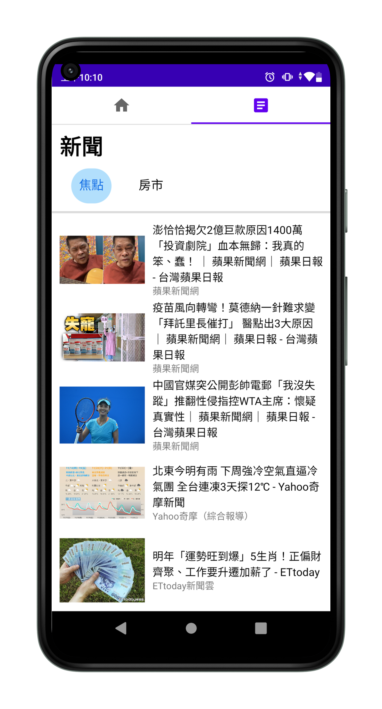

# Android-Application
This is my first application. It contains a complete login and registration system. After logging in, there is a news list inside, which uses [NewsAPI](https://newsapi.org/) to get the headlines from the API.

 

## Download link
<https://u.pcloud.link/publink/show?code=XZse5zVZYaw4g66OyskkIaWYrASG9HRzFUkX>

## Requirements

* Android Studio
* Git
* Android 9.0 and higher

## Common setup

Clone the repo and install the dependencies.

```bash
git clone https://github.com/January07/Android-Application.git
```

Open Android Studio and create a new project from the just downloaded source.